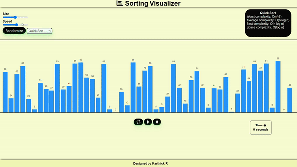

# Sorting Visualizer

This is a sorting visualizer tool implemented in JavaScript, HTML, and CSS. It allows you to visualize various sorting algorithms in action.

## Demo

<a href="https://rkkarthi07.github.io/Sorting_Visualizer/"><strong>➥ Live Demo</strong></a>

## Usage

1. **Set Array Size:** Use the slider to set the size of the array.
2. **Create Array:** Click the "Randomize" button to generate a random array based on the selected size.
3. **Select Sorting Algorithm:** Choose a sorting algorithm from the dropdown menu.
4. **Set Speed:** Adjust the speed of the visualization using the speed slider.
5. **Start Sorting:** Click the "Resume" button to start the sorting process.
6. **Pause Sorting:** Click the "Pause" button to temporarily halt the sorting process.
7. **Repeat:** Click the "Repeat" button to reset the array and restart the sorting process.

**Note:** Avoid clicking "Repeat" or "Randomize" during the sorting process, as it may interfere with the ongoing visualization.

## Sorting Algorithms

1. **Bubble Sort:** O(n^2) time complexity.
2. **Insertion Sort:** O(n^2) time complexity.
3. **Selection Sort:** O(n^2) time complexity.
4. **Merge Sort:** O(n\*log(n)) time complexity.
5. **Quick Sort:** O(n^2) worst case, O(n log n) average and best case.

## Additional Information

- The array elements are represented as blocks, and their heights correspond to their values.
- The color of the blocks changes during the sorting process to visualize the algorithm's progress.
- The timer at the top of the page displays the elapsed time since the sorting process started.

## Tips

- For large arrays, the distance between blocks adjusts to fit the screen.
- Adjust the speed slider to control the visualization speed.

## License

This project is licensed under the [MIT License](LICENSE).

## Contact

For questions or inquiries, please contact [Your Name](mailto:rkkarthick68@example.com).
